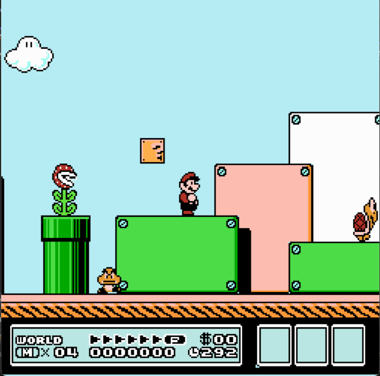

<p align="center">
  <a href="https://www.uit.edu.vn/" title="Trường Đại học Công nghệ Thông tin" style="border: none;">
    
  </a>
</p>

# SE102-Mario-Game

This project aims to recreate the classic game Super Mario Bros 3 using DirectX 10. The game will feature similar gameplay mechanics, levels, and visual style as the original game.

## Prerequisites

Before running the game, ensure that you have the following installed:

- DirectX 10 SDK
- C++ compiler
- Git (for cloning the repository)

## Getting Started

To get started with the game, follow the steps below:

1. Clone the repository using the following command:
```shell
git clone https://github.com/4nh3k/SE102-Mario-Game.git
```

2. Open the project in your preferred C++ development environment (e.g., Visual Studio).

3. Build the project using the provided build configuration.

4. Run the game executable.

## Game Controls

The game controls are as follows:

- **Arrow Keys**: Move Mario left/right and crouch
- **S**: Jump
- **A**: Run
- **Q**: Toggle in main menu
- **W**: Select/Enter
- **Esc**: Pause/Resume the game

## Game Features

The project aims to recreate the following features from Super Mario Bros 3:

- Side-scrolling platformer gameplay.
- Multiple levels with varying obstacles and enemies.
- Power-ups, such as the Super Mushroom, Super Leaf and Fire Flower.
- Mario's ability to fly using the Super Leaf power-up, allowing him to soar through the air and reach new heights.
- Collectible coins and power-ups.
- Enemies, including Goombas, Koopas, and more.
- Warp pipes and hidden areas.
- Score system and level progression.
- User interface and menu system.

## Development Details

The game is developed using the following technologies and tools:

- Programming Language: C++
- Graphics API: DirectX 10
- Development Environment: Visual Studio
- Version Control: Git

## Acknowledgments

This project is inspired by the original Super Mario Bros 3 game developed by Nintendo. Special thanks to the developers and contributors of the DirectX 10 SDK and the various resources available for game development.

## Screenshots





## References

- Super Mario Bros 3: [https://en.wikipedia.org/wiki/Super_Mario_Bros._3](https://en.wikipedia.org/wiki/Super_Mario_Bros._3)
- DirectX Developer Center: [https://docs.microsoft.com/en-us/windows/win32/directx-sdk--directx-sdk-june-2010](https://docs.microsoft.com/en-us/windows/win32/directx-sdk--directx-sdk-june-2010)
